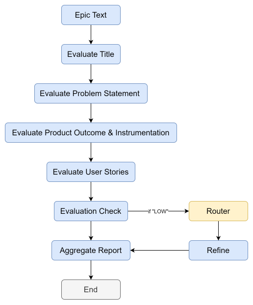

# Epic Evaluation Agentic System

## Overview
This is a project that is a multi-agent system that analyzes and parses epic documents using Langgraph and Gemini LLM. The system implements structured parsing, conditional evaluation, and refinement logic.

## Technologies
- Python
- LangGraph
- Google Gemini (2.0 Flash)
- Pydantic

## Workflow
1. **Parsing** – Extracts elements (title, problem statement, etc.)
2. **Evaluation** – Each element evaluated for quality, explanation, recommendation
3. **Router** – Conditional logic to decide whether to continue, refine or stop
4. **Refinement** – Weak elements are improved (up to 2 times)
5. **Aggregation** – Generates a final JSON report

## Node Overview

| Node | Function |
|------|----------|
| `parse` | Parses epic into components |
| `evaluate_*` | Evaluates individual components |
| `router` | Decides next step based on evaluation |
| `refine` | Enhances weak parts (if needed) |
| `aggregate_report` | Final report compilation |

## LangGraph Flow



## How to Run

```bash
streamlit run main.py
